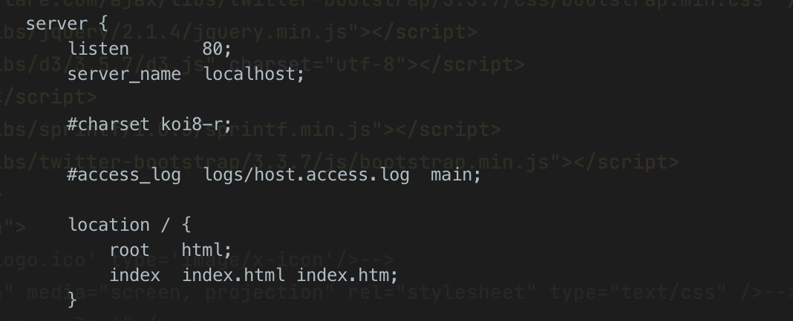

# PandaWeb tutorial

* How to install nginx
* How to run nginx
* How to develop
* How to test
* How to PR (pull request)
* How to follow

## 1 The requirements
* nginx
* the latest golang
* the Docker

## 2 Development and installation
### 2.1 install in Cluster
#### 2.1.1 How to install nginx
```bash
 # Download nginx install package
 wget https://nginx.org/download/nginx-1.20.1.tar.gz
 
 # Decompression
 tar -xvf nginx-1.20.1.tar.gz 
 
 # configuration and install
 cd nginx-1.20.1/
 ./configure --prefix=/usr/local/nginx
 sudo make install
 
 # start serve
 sudo /usr/local/nginx/sbin/nginx 
 
 # stop serve
 sudo /usr/local/nginx/sbin/nginx -s stop
```

#### 2.1.2 nginx configuration

> cd into /usr/local/nginx/conf file
>
> Open nginx.conf file (vim nginx.conf)



> 1. Change the "listen" to 80 port in server configuration
> 2. Put the Web page into the HTML directory, then change the name of the web file to index.html. 
> 3. Restart Nginx
> 4. Then you will open th web page after access the current IP address. If there are no web page displayed, the firewall may be disabled.

#### 2.1.3 Here is the Firewall configuration

```bash
 # Firewall Configuration
 cat /etc/sysconfig/iptables-config
 
 # Restart Firewall, Load Configuration
 systemctl start iptables
 
 # Ver
 cat /proc/version   uname -a
 
 # start, Reload, Stop, Check防火墙
 systemctl start/reload/stop/status firewalld
 
 root needed
 # Enable the firewall for the specified port
 firewall-cmd --zone=public --add-port=80/tcp --permanent
 # Disable the firewall for the specified port
 firewall-cmd --zone=public --remove-port=8081/tcp --permanent 
 # Reload the Firewall Configuration
 firewall-cmd --reload   
 # Check all the enable ports
 firewall-cmd --list-ports   
```
### 2.2 install in MacOS
```bash
# install golang
brew install go
go get -u github.com/gin-gonic/gin
# go mod init PandaGenetics
# go mody tidy
```
run in terminal
```bash
go run main.go
```
Install Docker Desktop on Mac
[Docker installation](https://docs.docker.com/engine/install/)
run docker
```bash
docker build . -t pandaweb
docker container ls -a
docker run -d -p 8080:8080 pandaweb
docker container ls -a
docker stop docker_ID
```

